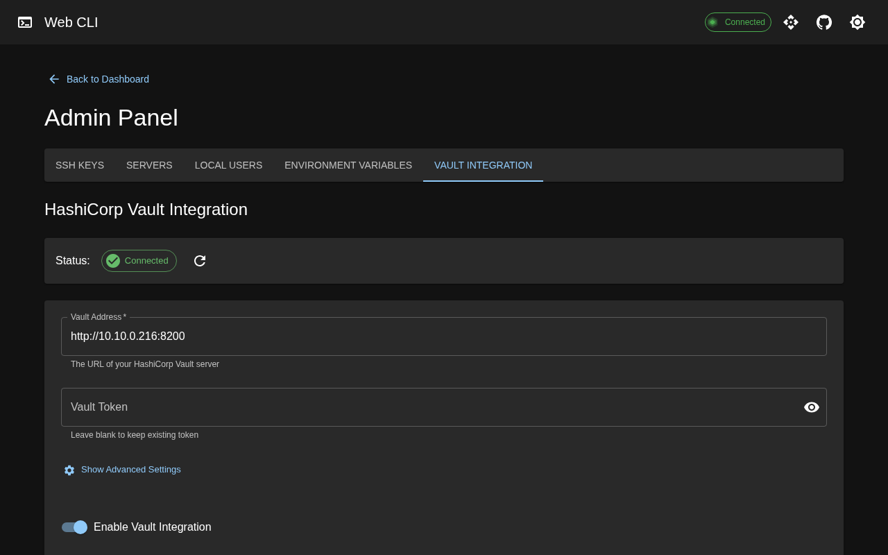

# Web CLI

[](https://golang.org)
[](https://react.dev)
[](https://mui.com)
[](LICENSE)
[](https://hub.docker.com/r/polinux/web-cli)

A powerful web-based interface for executing commands on local and remote Linux servers. Built with Go and React with Material-UI for a professional, modern user experience.


## Features

- **Interactive Terminal** - Full browser-based terminal with xterm.js, multi-tab support, SSH key integration
- **Command Execution** - Execute commands locally or remotely via SSH with real-time output
- **Server Management** - Manage SSH keys, servers, and connection settings
- **Script Library** - Store and execute bash scripts with environment variable injection
- **Command Templates** - Save frequently-used commands for quick re-execution
- **Developer Tools** - YAML/JSON validators with Monaco Editor (VS Code engine)
- **HashiCorp Vault** - Optional integration for external secrets management
- **Security** - AES-256 encryption, TLS support, authentication, audit logging

## Quick Start

### Docker Compose (Recommended)

Create a `docker-compose.yml`:

```yaml
services:
  web-cli:
    image: polinux/web-cli:latest
    container_name: web-cli
    restart: unless-stopped
    ports:
      - "7777:7777"
    volumes:
      - web-cli-data:/data
    environment:
      - AUTH_ENABLED=true
      - AUTH_USERNAME=admin
      - AUTH_PASSWORD=changeme123

volumes:
  web-cli-data:
```

Run:

```bash
docker compose up -d
```

Access at: **http://localhost:7777**

### Docker Run

```bash
docker run -d \
  --name web-cli \
  -p 7777:7777 \
  -v web-cli-data:/data \
  -e AUTH_ENABLED=true \
  -e AUTH_USERNAME=admin \
  -e AUTH_PASSWORD=your-password \
  polinux/web-cli:latest
```

### From Source

```bash
# Clone and build
git clone https://github.com/pozgo/web-cli.git
cd web-cli
./build.sh

# Run
./web-cli
```

## Screenshots

| Interactive Terminal | Remote Commands |
|:---:|:---:|
|  |  |

| Admin Panel | Vault Integration |
|:---:|:---:|
|  |  |

## Documentation

| Document | Description |
|----------|-------------|
| **[API.md](API.md)** | Complete REST API reference (55 endpoints) |
| **[docs/CONFIGURATION.md](docs/CONFIGURATION.md)** | Configuration options, env vars, config files |
| **[docs/SECURITY.md](docs/SECURITY.md)** | Security features, authentication, TLS, audit logging |
| **[docs/DEPLOYMENT.md](docs/DEPLOYMENT.md)** | Docker, systemd, production deployment guides |
| **[docs/DEVELOPMENT.md](docs/DEVELOPMENT.md)** | Development setup, project structure, contributing |

## API

Swagger UI available at `/swagger/` when the server is running.

```bash
# Health check
curl http://localhost:7777/api/health

# Execute command (with auth)
curl -u admin:password -X POST http://localhost:7777/api/commands/execute \
  -H "Content-Type: application/json" \
  -d '{"command": "uptime", "user": "current"}'
```

See [API.md](API.md) for complete documentation.

## Configuration

### Essential Environment Variables

| Variable | Default | Description |
|----------|---------|-------------|
| `AUTH_ENABLED` | `false` | Enable authentication |
| `AUTH_USERNAME` | - | Basic auth username |
| `AUTH_PASSWORD` | - | Basic auth password |
| `WEBCLI_PORT` | `7777` | Server port |
| `WEBCLI_TLS_CERT_PATH` | - | TLS certificate (enables HTTPS) |
| `WEBCLI_TLS_KEY_PATH` | - | TLS private key |

See [docs/CONFIGURATION.md](docs/CONFIGURATION.md) for all options.

## Production Deployment

```bash
# Generate secure credentials
AUTH_PASSWORD=$(openssl rand -base64 24)
ENCRYPTION_KEY=$(openssl rand -base64 32)

# Run with TLS and authentication
docker run -d \
  --name web-cli \
  -p 7777:7777 \
  -v web-cli-data:/data \
  -v ./certs:/certs:ro \
  -e AUTH_ENABLED=true \
  -e AUTH_USERNAME=admin \
  -e AUTH_PASSWORD="$AUTH_PASSWORD" \
  -e ENCRYPTION_KEY="$ENCRYPTION_KEY" \
  -e WEBCLI_TLS_CERT_PATH=/certs/cert.pem \
  -e WEBCLI_TLS_KEY_PATH=/certs/key.pem \
  -e CORS_ALLOWED_ORIGINS=https://web-cli.yourdomain.com \
  polinux/web-cli:latest
```

See [docs/DEPLOYMENT.md](docs/DEPLOYMENT.md) for systemd service, production checklist, and more.

## Tech Stack

**Backend:** Go 1.21+, Gorilla Mux, SQLite, AES-256-GCM encryption

**Frontend:** React 18, Material-UI v5, xterm.js, Monaco Editor, Vite

## Contributing

1. Fork the repository
2. Create a feature branch (`git checkout -b feature/amazing-feature`)
3. Commit your changes (`git commit -m 'Add amazing feature'`)
4. Push to the branch (`git push origin feature/amazing-feature`)
5. Open a Pull Request

See [docs/DEVELOPMENT.md](docs/DEVELOPMENT.md) for development setup.

## License

MIT License - see [LICENSE](LICENSE) for details.

## Support

- [GitHub Issues](https://github.com/pozgo/web-cli/issues)
- [API Documentation](API.md)
- [Security Guide](docs/SECURITY.md)

---

**Made with ❤️ by [Pozgo](https://github.com/pozgo)**
