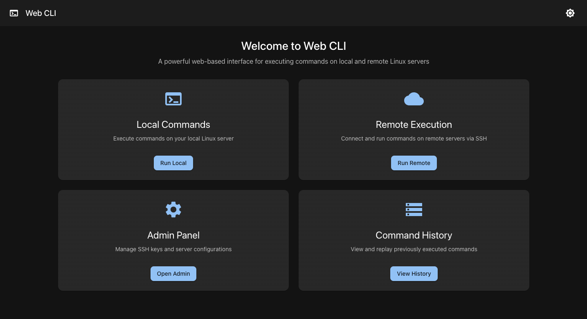
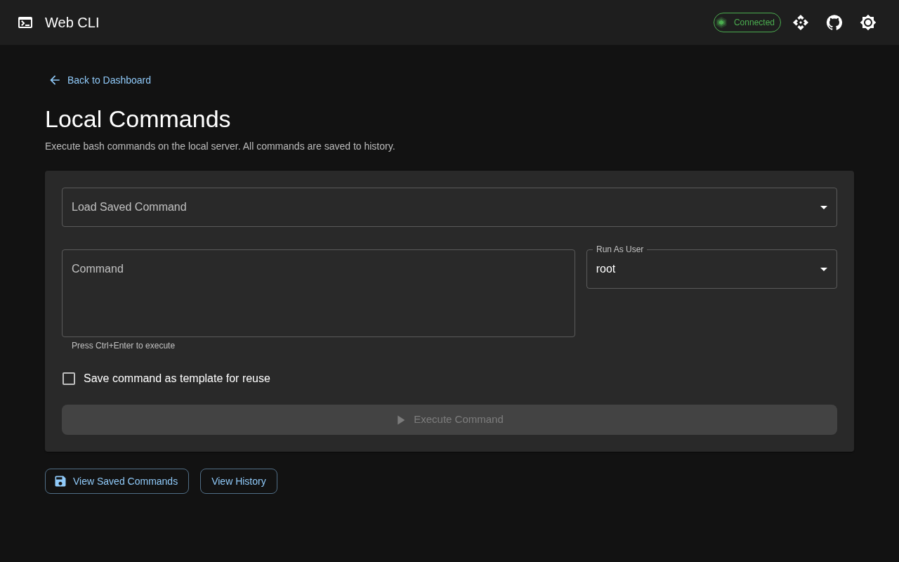
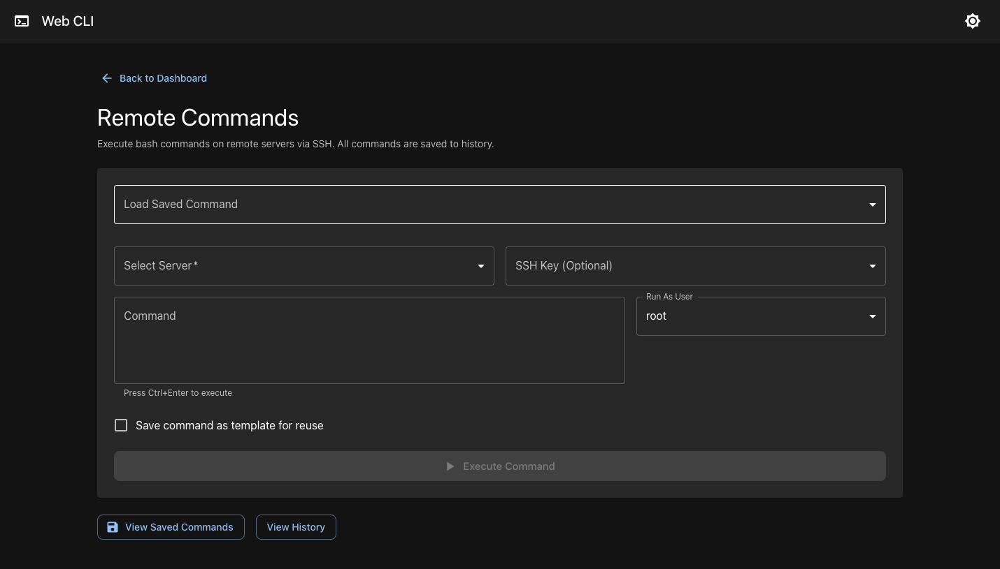
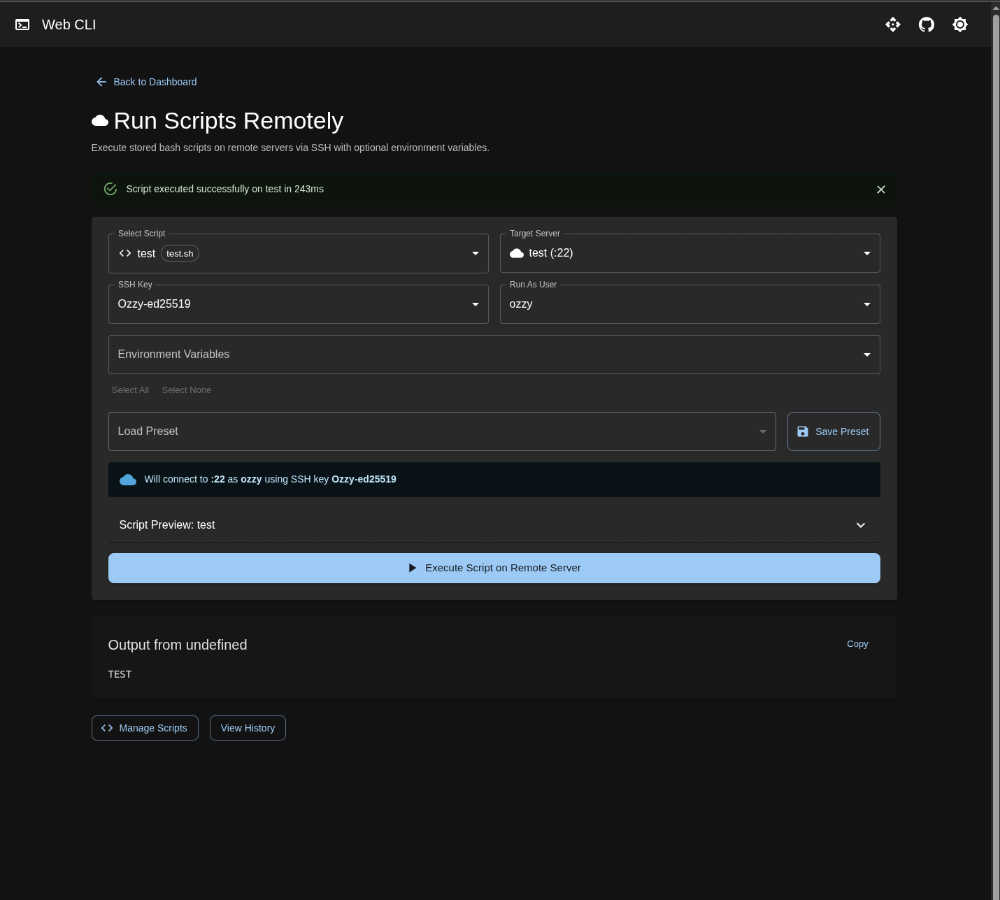
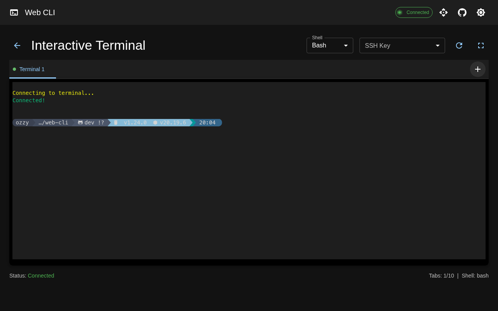
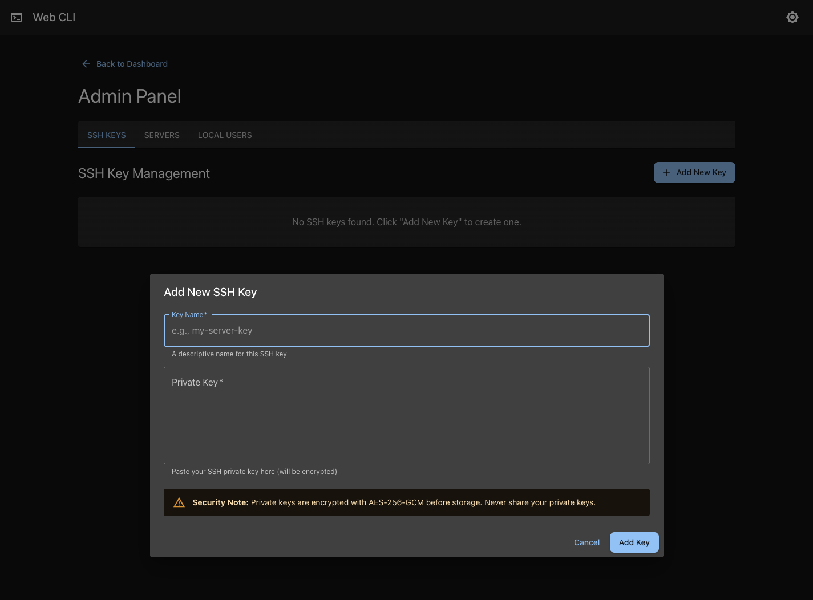
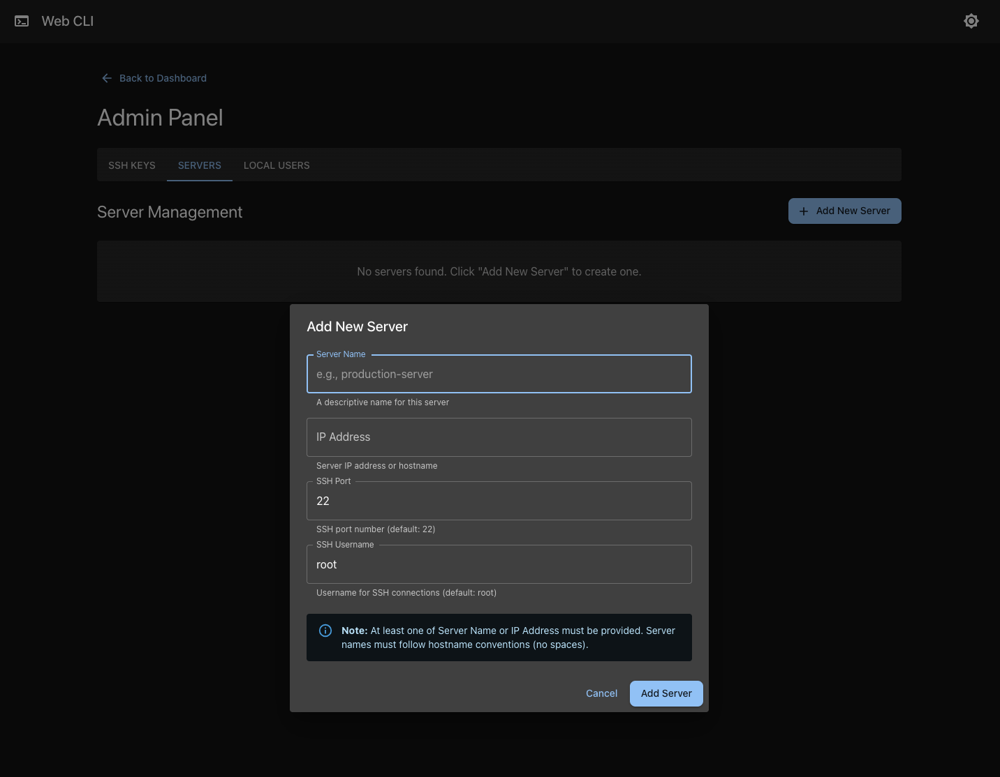
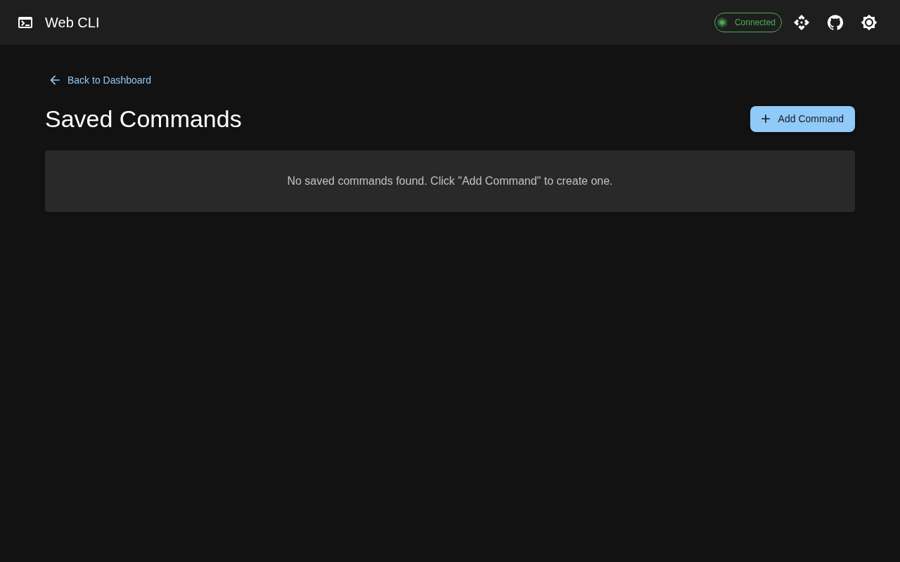
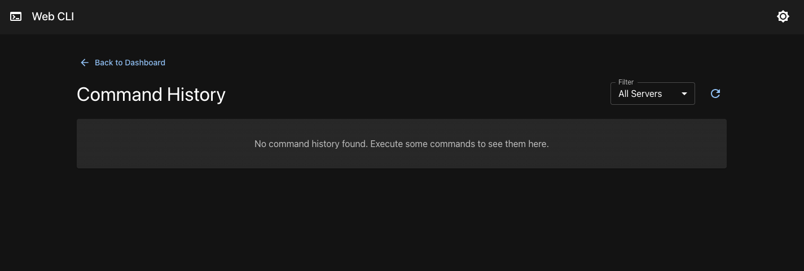

# Web CLI

[](https://golang.org)
[](https://react.dev)
[](https://mui.com)
[](LICENSE)

A powerful web-based interface for executing commands on local and remote Linux servers. Built with Go and React with Material-UI for a professional, modern user experience.


*Main dashboard with feature cards for easy navigation*

## 📋 Table of Contents

- [Features](#-features)
- [Tech Stack](#-tech-stack)
- [Screenshots](#-screenshots)
- [Prerequisites](#-prerequisites)
- [Installation](#-installation)
- [Quick Start](#-quick-start)
- [Usage](#-usage)
- [API Documentation](#-api-documentation)
- [Configuration](#-configuration)
- [Security](#-security)
- [Deployment](#-deployment)
- [Development](#-development)
- [Contributing](#-contributing)
- [License](#-license)

## ✨ Features

### Core Functionality
- **Web-Based Interface**: Professional Material-UI dashboard accessible from any browser
- **Theme Support**: Dark and light mode toggle with preferences saved locally
- **Multi-Platform**: Compiled binaries for Linux x64, macOS Intel, and macOS Apple Silicon

### Interactive Terminal
- **Full Browser-Based Terminal**: Real-time terminal emulator powered by xterm.js with WebSocket backend
- **Multiple Shell Support**: Choose between Bash, Zsh, or Sh shells
- **SSH Key Integration**: Select SSH keys from the dropdown - automatically injected into terminal sessions
- **Server Name Resolution**: Servers from Admin Panel automatically available as SSH hostname aliases
- **Dynamic Resize**: Terminal automatically resizes with proper 256-color support
- **Fullscreen Mode**: Toggle fullscreen for distraction-free terminal access

### Command Execution
- **Local Commands**: Execute bash commands on your local server with real-time output
- **Remote Commands**: Connect and execute commands on remote servers via SSH
- **User Selection**: Run commands as different users (current, root, or custom)
- **Sudo Support**: Secure password dialog for root command execution

### Server & SSH Management
- **Admin Panel**: Full management interface with tabbed sections
- **SSH Key Management**: CRUD operations for SSH private keys
- **Server Management**: Manage remote servers with hostname, IP, port, and username
- **Hostname Validation**: Automatic validation according to hostname conventions

### Command Templates & History
- **Command Templates**: Save frequently-used commands for quick re-execution
- **Command Type Management**: Visual indicators (Local/Remote) with type switching
- **Smart Navigation**: Execute button routes to appropriate page based on command type
- **Command History**: Complete execution history with output, exit codes, and timing

### Environment Variables
- **Secure Storage**: Store sensitive environment variables with AES-256-GCM encryption
- **Masked Display**: Values masked by default in API responses
- **Script Injection**: Inject stored env vars into script executions

### Bash Scripts
- **Script Library**: Store and manage reusable bash scripts
- **Local & Remote Execution**: Execute scripts on local or remote servers
- **Script Presets**: Save execution configurations (server, SSH key, user, env vars)
- **Environment Integration**: Inject stored environment variables into scripts

### Security
- **Authentication**: HTTP Basic Auth and Bearer token support (configurable)
- **TLS/HTTPS Support**: Native TLS support with optional HTTPS enforcement
- **Security Headers**: X-Frame-Options, X-Content-Type-Options, X-XSS-Protection, Referrer-Policy
- **SSH Host Key Verification**: Proper host key checking against known_hosts with TOFU support
- **Input Validation**: Comprehensive validation for all user inputs
- **Encrypted Database**: SQLite with AES-256-GCM encryption for sensitive data
- **bcrypt Password Hashing**: Secure password hashing with cost factor 12
- **HTTP Timeouts**: Protection against slowloris and DoS attacks
- **CORS Policy**: Restrictive CORS with configurable origins
- **Secure Password Handling**: SSH passwords never stored in command history
- **Automatic Encryption**: All SSH keys, scripts, and env variables encrypted at rest
- **Entropy Verification**: System entropy check before cryptographic key generation (Linux)
- **Database Migrations**: Automatic schema versioning and migration system

## 🛠 Tech Stack

### Backend
- **[Go 1.21+](https://golang.org/)**: High-performance backend server
- **[Gorilla Mux](https://github.com/gorilla/mux)**: HTTP router for API endpoints
- **[Gorilla WebSocket](https://github.com/gorilla/websocket)**: WebSocket support for interactive terminal
- **[creack/pty](https://github.com/creack/pty)**: PTY (pseudo-terminal) handling for terminal emulation
- **[Viper](https://github.com/spf13/viper)**: Configuration management with env, file, and flag support
- **[Swaggo/swag](https://github.com/swaggo/swag)**: Swagger API documentation generator
- **[SQLite](https://www.sqlite.org/)**: Embedded database with migration support
- **[golang.org/x/crypto/ssh](https://pkg.go.dev/golang.org/x/crypto/ssh)**: SSH client with host key verification
- **[golang.org/x/crypto/bcrypt](https://pkg.go.dev/golang.org/x/crypto/bcrypt)**: Secure password hashing
- **AES-256-GCM**: Military-grade encryption for sensitive data
- **Authentication Middleware**: HTTP Basic Auth and Bearer token support
- **Security Middleware**: HTTPS enforcement and security headers
- **Input Validation**: Comprehensive validation for security

### Frontend
- **[React 18](https://react.dev/)**: Modern UI library
- **[React Router v6](https://reactrouter.com/)**: Client-side routing
- **[Material-UI (MUI) v5](https://mui.com/)**: Professional component library
- **[xterm.js](https://xtermjs.org/)**: Terminal emulator for the browser
- **[Vite](https://vitejs.dev/)**: Fast build tool and dev server
- **[Emotion](https://emotion.sh/)**: CSS-in-JS styling
- **[Swagger UI](https://swagger.io/tools/swagger-ui/)**: Interactive API documentation

## 📸 Screenshots

### Dashboard

*Main dashboard with feature cards for easy navigation*

### Local Command Execution

*Execute commands on your local server with real-time output*

### Remote Command Execution

*Connect to remote servers via SSH and execute commands*

### Remote Script Execution

*Connect to remote servers via SSH and execute script*

### Interactive Terminal

*Full browser-based terminal with SSH key integration and server aliases*

### Admin Panel - SSH Keys

*Manage SSH private keys for server authentication*

### Admin Panel - Servers

*Configure and manage remote servers*

### Saved Commands

*Save and reuse frequently-used command templates with type indicators*

### Command History

*View complete execution history with output and timing*

## 📦 Prerequisites

- **Go**: Version 1.21 or higher ([Download](https://golang.org/dl/))
- **Node.js**: Version 18 or higher ([Download](https://nodejs.org/))
- **npm**: Version 8 or higher (comes with Node.js)

## 🚀 Installation

### Clone the Repository

```bash
git clone https://github.com/pozgo/web-cli.git
cd web-cli
```

### Install Dependencies

#### Backend
```bash
go mod download
```

#### Frontend
```bash
cd frontend
npm install
cd ..
```

## ⚡ Quick Start

### Build and Run

```bash
# Build the application
./build.sh

# Run the server
./web-cli
```

Access the application at `http://localhost:7777`

### Using Management Script

```bash
# Start the server
./manage.sh start

# Stop the server
./manage.sh stop

# Check status
./manage.sh status
```

## 📖 Usage

### Interactive Terminal

1. Navigate to **Interactive Terminal** from the dashboard
2. Select your preferred shell (Bash, Zsh, or Sh)
3. Optionally select an SSH key from the dropdown
4. Use the terminal like a native terminal - full PTY support
5. SSH to servers using aliases: `ssh myserver` (servers from Admin Panel)
6. Toggle fullscreen with the fullscreen button

**SSH Server Aliases:**
When you add servers in the Admin Panel, they become available as SSH aliases in the terminal:
```bash
# If you added a server named "prod" with IP 10.0.0.5 and user "deploy"
ssh prod  # Automatically connects to deploy@10.0.0.5
```

### Local Command Execution

1. Navigate to **Local Commands** from the dashboard
2. Enter your bash command
3. Select the user to run as (current, root, or custom)
4. Click **Execute Command**
5. View real-time output

### Remote Command Execution

1. First, add SSH keys and servers in the **Admin Panel**
2. Navigate to **Remote Execution**
3. Select a server from the dropdown
4. Choose an SSH key (optional, password fallback available)
5. Enter your command and click **Execute**

### Saved Command Templates

1. Execute any command and check "Save command as template"
2. Access saved commands from the **Saved Commands** page
3. Edit command type (Local/Remote) and details
4. Execute saved commands with one click

## 📚 API Documentation

Web CLI provides a comprehensive RESTful API for programmatic access to all features. Perfect for automation, CI/CD pipelines, and integration with other tools.

### 🚀 Quick Start

**Base URL**: `http://localhost:7777/api`

**Example Request**:
```bash
curl http://localhost:7777/api/health
# Response: {"status":"ok"}
```

### 📋 API Endpoints Overview

| Category | Endpoints | Description |
|----------|-----------|-------------|
| **Health** | 1 endpoint | Server health check |
| **Terminal** | 1 WebSocket | Interactive terminal sessions |
| **SSH Keys** | 5 endpoints | Manage SSH private keys |
| **Servers** | 5 endpoints | Manage remote servers |
| **Local Users** | 5 endpoints | Manage local user accounts |
| **System Info** | 1 endpoint | Get current system user |
| **Commands** | 1 endpoint | Execute local/remote commands |
| **Saved Commands** | 5 endpoints | Manage command templates |
| **History** | 2 endpoints | View execution history |
| **Environment Variables** | 5 endpoints | Manage encrypted env variables |
| **Bash Scripts** | 6 endpoints | Manage and execute scripts |
| **Script Presets** | 5 endpoints | Manage execution presets |

**Total: 43 endpoints (42 REST + 1 WebSocket)**

### 📘 Swagger UI

Interactive API documentation is available at `/swagger/` when the server is running.

Access: `http://localhost:7777/swagger/`

### 📖 Complete Documentation

For detailed API documentation including:
- ✅ All 41 endpoints with full descriptions
- ✅ Request/response examples with cURL commands
- ✅ Field descriptions and validation rules
- ✅ Error response formats and status codes
- ✅ Security considerations and best practices
- ✅ Authentication guidance for production
- ✅ Quick reference table for all endpoints

**👉 See [API.md](API.md) for complete API reference**

### 💡 Common Use Cases

**Note:** If authentication is enabled, add `-u username:password` or `-H "Authorization: Bearer token"` to all requests.

**Execute a local command**:
```bash
curl -u admin:password -X POST http://localhost:7777/api/commands/execute \
  -H "Content-Type: application/json" \
  -d '{"command": "df -h", "user": "root"}'
```

**Execute a remote command via SSH**:
```bash
curl -u admin:password -X POST http://localhost:7777/api/commands/execute \
  -H "Content-Type: application/json" \
  -d '{
    "command": "uptime",
    "is_remote": true,
    "server_id": 1,
    "ssh_key_id": 2
  }'
```

**List command history**:
```bash
curl -u admin:password "http://localhost:7777/api/history?limit=10&server=local"
```

**Using Bearer Token**:
```bash
curl -H "Authorization: Bearer your-api-token" \
  -X POST http://localhost:7777/api/commands/execute \
  -H "Content-Type: application/json" \
  -d '{"command": "uptime", "user": "current"}'
```

## ⚙️ Configuration

### Command-Line Flags

```bash
./web-cli [options]

Options:
  -port int              Port to listen on (default: 7777)
  -host string           Host to bind to (default: 0.0.0.0)
  -frontend string       Path to frontend build files (default: ./frontend/dist)
  -db string             Path to database file (default: ./data/web-cli.db)
  -encryption-key string Path to encryption key file (default: ./.encryption_key)
  -tls-cert string       Path to TLS certificate file (enables HTTPS)
  -tls-key string        Path to TLS private key file
  -require-https         Require HTTPS when auth is enabled (reject HTTP requests)
```

### Environment Variables

All configuration options can be set via environment variables:

```bash
# Standard environment variables
PORT=8080 HOST=localhost ./web-cli

# WEBCLI-prefixed variables (recommended)
WEBCLI_PORT=8080
WEBCLI_HOST=localhost
WEBCLI_DATABASE_PATH=/var/lib/web-cli/web-cli.db
WEBCLI_ENCRYPTION_KEY_PATH=/etc/web-cli/encryption.key
WEBCLI_TLS_CERT_PATH=/etc/ssl/certs/web-cli.crt
WEBCLI_TLS_KEY_PATH=/etc/ssl/private/web-cli.key
WEBCLI_REQUIRE_HTTPS=true
```

### Configuration File

Web CLI supports configuration files in YAML, JSON, or TOML format. Configuration files are searched in the following locations (first found is used):

1. `./config.yaml` (current directory)
2. `./config/config.yaml` (config subdirectory)
3. `/etc/web-cli/config.yaml` (system config)
4. `~/.config/web-cli/config.yaml` (user config)

**Example config.yaml:**

```yaml
port: 7777
host: "0.0.0.0"
frontend_path: "./assets/frontend"
database_path: "./data/web-cli.db"
encryption_key_path: "./.encryption_key"
tls_cert_path: "/etc/ssl/certs/web-cli.crt"
tls_key_path: "/etc/ssl/private/web-cli.key"
require_https: true
```

### Configuration Priority

1. Command-line flags (highest priority)
2. Environment variables
3. Configuration file
4. Default values (lowest priority)

## 🔒 Security

### Authentication (Production Ready)

**Important: Authentication is disabled by default for development convenience.**

For production deployments, enable authentication:

```bash
# Enable authentication
export AUTH_ENABLED=true

# Option 1: HTTP Basic Authentication
export AUTH_USERNAME="admin"
export AUTH_PASSWORD="your-secure-password"

# Option 2: API Token (Bearer)
export AUTH_API_TOKEN="your-api-token-here"
```

**Features:**
- HTTP Basic Authentication support
- Bearer token (API token) support  
- Constant-time credential comparison (prevents timing attacks)
- Supports both methods simultaneously (token takes precedence)

**Usage Examples:**

```bash
# Basic Auth
curl -u admin:password http://localhost:7777/api/health

# Bearer Token
curl -H "Authorization: Bearer your-token" http://localhost:7777/api/health
```

### TLS/HTTPS Support

**Native TLS support for encrypted connections:**

```bash
# Enable TLS with certificate and key
./web-cli -tls-cert /path/to/cert.pem -tls-key /path/to/key.pem

# Or via environment variables
WEBCLI_TLS_CERT_PATH=/path/to/cert.pem \
WEBCLI_TLS_KEY_PATH=/path/to/key.pem \
./web-cli

# Enforce HTTPS when authentication is enabled
./web-cli -tls-cert cert.pem -tls-key key.pem -require-https
```

**Features:**
- Native Go TLS implementation (no reverse proxy required)
- Automatic HTTPS when certificate and key are provided
- Optional HTTPS enforcement (rejects HTTP requests)
- Works with any TLS certificate (self-signed, Let's Encrypt, etc.)

**Generate self-signed certificate for testing:**

```bash
openssl req -x509 -newkey rsa:4096 -keyout key.pem -out cert.pem \
  -days 365 -nodes -subj "/CN=localhost"
```

### SSH Host Key Verification

**Proper host key verification for secure SSH connections:**

- Verifies SSH host keys against `~/.ssh/known_hosts`
- Supports "trust on first use" mode for development
- Detects man-in-the-middle attacks (host key mismatch)
- Automatically saves new trusted host keys
- Thread-safe implementation

**Configuration:**
- **Strict Mode** (production): Rejects unknown hosts
- **Trust-on-First-Use** (development): Automatically trusts new hosts

### Input Validation

**All user inputs are validated before processing:**

- IP addresses (IPv4/IPv6)
- Hostnames (RFC 1123 compliant)
- Port numbers (1-65535)
- SSH private keys (format validation)
- Unix usernames (alphanumeric, dash, underscore)
- Command names (no null bytes or newlines)

### HTTP Security

**Server configured with proper timeouts:**

```go
ReadTimeout:  15 * time.Second  // Prevents slowloris attacks
WriteTimeout: 15 * time.Second  // Prevents slow writes  
IdleTimeout:  60 * time.Second  // Prevents idle connections
```

**CORS Policy:**

- Default: localhost only
- Production: Configure via `CORS_ALLOWED_ORIGINS` environment variable

```bash
# Single origin
export CORS_ALLOWED_ORIGINS="https://web-cli.example.com"

# Multiple origins (comma-separated)
export CORS_ALLOWED_ORIGINS="https://web-cli.example.com,https://admin.example.com"
```

### Database Encryption

All sensitive data is encrypted using **AES-256-GCM**:
- SSH private keys encrypted at rest
- Command history (commands and output) encrypted
- Encryption key auto-generated on first run
- Key stored in `.encryption_key` with 600 permissions

### Encryption Key Management

**Important:**
- Backup your `.encryption_key` file - data cannot be recovered without it
- For production, use environment variable instead of file

**Generate a new encryption key:**

```bash
# macOS/Linux
openssl rand -base64 32

# Or using dd and base64
dd if=/dev/urandom bs=32 count=1 2>/dev/null | base64

# Output example: 7xK9mP2vQ8nL4wR6tY5uE3sA1zD0cF8bG7hJ9kM6nP4=
```

**Use the generated key:**

```bash
# Option 1: Environment variable (recommended for production)
export ENCRYPTION_KEY="7xK9mP2vQ8nL4wR6tY5uE3sA1zD0cF8bG7hJ9kM6nP4="
./web-cli

# Option 2: Save to file (auto-generated on first run if not exists)
echo "7xK9mP2vQ8nL4wR6tY5uE3sA1zD0cF8bG7hJ9kM6nP4=" > .encryption_key
chmod 600 .encryption_key
./web-cli
```

### Password Security

- Sudo passwords only used for command execution
- SSH passwords used for authentication fallback
- **Passwords are never stored** in command history
- Passwords cleared from memory after use

### Database Migrations

- Automatic schema versioning
- Migrations run on startup
- Safe to restart - migrations only run once
- Current schema version: **14**

## 🌐 Deployment

### Linux Server

```bash
# Build for Linux
./build.sh all

# Copy to server
scp bin/web-cli-linux-x64 user@server:/opt/web-cli/web-cli

# Run on server
ssh user@server
cd /opt/web-cli
./web-cli
```

### systemd Service

Create `/etc/systemd/system/web-cli.service`:

```ini
[Unit]
Description=Web CLI Service
After=network.target

[Service]
Type=simple
User=www-data
WorkingDirectory=/opt/web-cli
ExecStart=/opt/web-cli/web-cli
Restart=on-failure

# Security Configuration (REQUIRED for production)
Environment=AUTH_ENABLED=true
Environment=AUTH_USERNAME=admin
Environment=AUTH_PASSWORD=your-secure-password-here
Environment=CORS_ALLOWED_ORIGINS=https://web-cli.yourdomain.com
Environment=ENCRYPTION_KEY=your-encryption-key-here

[Install]
WantedBy=multi-user.target
```

Enable and start:

```bash
sudo systemctl enable web-cli
sudo systemctl start web-cli
sudo systemctl status web-cli
```

### Production Deployment Checklist

Before deploying to production, ensure:

**Security Configuration:**
- ✅ **Authentication enabled**: Set `AUTH_ENABLED=true`
- ✅ **Strong credentials**: Configure `AUTH_USERNAME` and `AUTH_PASSWORD` (or `AUTH_API_TOKEN`)
- ✅ **SSH host key verification**: Enabled by default (uses `~/.ssh/known_hosts`)
- ✅ **CORS restricted**: Set `CORS_ALLOWED_ORIGINS` to your domain(s)
- ✅ **HTTP timeouts**: Configured automatically (prevents DoS attacks)
- ✅ **Input validation**: All inputs validated automatically

**Additional Requirements:**
- [ ] **HTTPS enabled**: Use native TLS (`-tls-cert`, `-tls-key`) or reverse proxy
- [ ] **Encryption key backup**: Backup `.encryption_key` - data cannot be recovered without it
- [ ] **Security scan**: Run `gosec ./...` or similar security scanner
- [ ] **Monitor logs**: Check for authentication failures and errors
- [ ] **Firewall configured**: Restrict access to authorized IPs if possible

**Production Environment Variables:**

```bash
# Authentication (REQUIRED for production)
AUTH_ENABLED=true
AUTH_USERNAME=admin
AUTH_PASSWORD=$(openssl rand -base64 32)  # Or your secure password
# OR use API token
AUTH_API_TOKEN=$(openssl rand -base64 32)

# CORS Policy (REQUIRED for production)
CORS_ALLOWED_ORIGINS=https://web-cli.yourdomain.com

# Encryption (REQUIRED)
ENCRYPTION_KEY=$(openssl rand -base64 32)

# TLS/HTTPS (RECOMMENDED for production)
WEBCLI_TLS_CERT_PATH=/etc/ssl/certs/web-cli.crt
WEBCLI_TLS_KEY_PATH=/etc/ssl/private/web-cli.key
WEBCLI_REQUIRE_HTTPS=true

# Server Config (Optional)
WEBCLI_PORT=7777
WEBCLI_HOST=0.0.0.0
```

**Testing Authentication:**

```bash
# Should fail (no auth)
curl http://localhost:7777/api/health

# Should succeed with Basic Auth
curl -u admin:password http://localhost:7777/api/health

# Should succeed with Bearer token
curl -H "Authorization: Bearer your-token" http://localhost:7777/api/health
```

### Docker

Web CLI is available as a Docker image for easy deployment.

**Image Details:**
- **Registry:** Docker Hub (`polinux/web-cli`)
- **Base Image:** Debian Bookworm (slim) - provides full bash support for script execution
- **Platforms:** `linux/amd64`, `linux/arm64`
- **Size:** ~100MB compressed

**Quick Start with Docker Compose:**

```bash
# Clone the repository
git clone https://github.com/pozgo/web-cli.git
cd web-cli

# Start with default settings
docker compose up -d

# View logs
docker compose logs -f
```

**Access:** `http://localhost:7777`

**Build Locally:**

```bash
# Build the image
docker compose build

# Or build directly
docker build -t web-cli .
```

**Run with Custom Configuration:**

```bash
# Copy example environment file
cp .env.example .env

# Edit .env with your settings
nano .env

# Start with custom configuration
docker compose up -d
```

**Production Deployment:**

```bash
# Create .env with production settings
cat > .env << 'EOF'
AUTH_ENABLED=true
AUTH_USERNAME=admin
AUTH_PASSWORD=$(openssl rand -base64 24)
WEBCLI_PORT=7777
EOF

# Start the container
docker compose up -d

# Check credentials
cat .env | grep AUTH_
```

**Docker Run (without Compose):**

```bash
docker run -d \
  --name web-cli \
  -p 7777:7777 \
  -v web-cli-data:/data \
  -e AUTH_ENABLED=true \
  -e AUTH_USERNAME=admin \
  -e AUTH_PASSWORD=your-secure-password \
  polinux/web-cli:latest
```

**With TLS/HTTPS:**

```bash
docker run -d \
  --name web-cli \
  -p 7777:7777 \
  -v web-cli-data:/data \
  -v ./certs:/certs:ro \
  -e WEBCLI_TLS_CERT_PATH=/certs/cert.pem \
  -e WEBCLI_TLS_KEY_PATH=/certs/key.pem \
  -e AUTH_ENABLED=true \
  -e AUTH_USERNAME=admin \
  -e AUTH_PASSWORD=your-secure-password \
  polinux/web-cli:latest
```

**Docker Environment Variables:**

| Variable | Default | Description |
|----------|---------|-------------|
| `WEBCLI_PORT` | `7777` | Port to listen on |
| `WEBCLI_HOST` | `0.0.0.0` | Host to bind to |
| `WEBCLI_DATABASE_PATH` | `/data/web-cli.db` | Database file path |
| `WEBCLI_ENCRYPTION_KEY_PATH` | `/data/.encryption_key` | Encryption key file path |
| `ENCRYPTION_KEY` | (auto-generated) | Base64 encryption key |
| `AUTH_ENABLED` | `false` | Enable authentication |
| `AUTH_USERNAME` | `admin` | Basic auth username |
| `AUTH_PASSWORD` | (none) | Basic auth password |
| `AUTH_API_TOKEN` | (none) | Bearer token |
| `WEBCLI_TLS_CERT_PATH` | (none) | TLS certificate path |
| `WEBCLI_TLS_KEY_PATH` | (none) | TLS private key path |
| `WEBCLI_REQUIRE_HTTPS` | `false` | Require HTTPS |
| `CORS_ALLOWED_ORIGINS` | (localhost) | Allowed CORS origins |

**Volumes:**

| Path | Description |
|------|-------------|
| `/data` | Persistent data (database, encryption key) |
| `/config` | Configuration files (optional) |
| `/certs` | TLS certificates (optional) |

## 💻 Development

### Backend Development

```bash
# Run with hot reload (use air or similar)
go run cmd/web-cli/main.go

# Run tests
go test ./...

# Run tests with coverage
go test -cover ./...

# Format code
go fmt ./...

# Lint code
go vet ./...
```

### Frontend Development

```bash
cd frontend

# Start dev server with hot reload
npm run dev

# Run tests
npm test

# Lint code
npm run lint

# Build for production
npm run build
```

### Development Workflow

1. Start backend:
   ```bash
   go run cmd/web-cli/main.go
   ```

2. Start frontend (new terminal):
   ```bash
   cd frontend && npm run dev
   ```

3. Open `http://localhost:3000` for hot-reload development

### Project Structure

```
web-cli/
├── cmd/web-cli/           # Application entry point
├── internal/              # Private application code
│   ├── config/            # Configuration management
│   ├── database/          # Database, migrations, encryption
│   ├── executor/          # Command execution (local & remote)
│   │   └── hostkeys.go    # SSH host key verification
│   ├── middleware/        # HTTP middleware (authentication)
│   ├── models/            # Data models
│   ├── repository/        # Data access layer
│   ├── server/            # HTTP server and handlers
│   ├── terminal/          # Interactive terminal (PTY + WebSocket)
│   └── validation/        # Input validation functions
├── frontend/              # React application
│   ├── src/
│   │   ├── components/    # React components
│   │   │   └── Terminal.jsx  # xterm.js terminal component
│   │   ├── theme/         # MUI theme configuration
│   │   └── App.jsx        # Main app with routing
│   └── vite.config.js     # Vite configuration
├── build.sh               # Build script (all platforms)
├── manage.sh              # Server management script
├── API.md                 # Complete API documentation
└── go.mod                 # Go dependencies
```

## 🤝 Contributing

Contributions are welcome! Please follow these steps:

1. Fork the repository
2. Create a feature branch (`git checkout -b feature/amazing-feature`)
3. Commit your changes (`git commit -m 'Add some amazing feature'`)
4. Push to the branch (`git push origin feature/amazing-feature`)
5. Open a Pull Request

### Development Guidelines

- Follow Go best practices and conventions
- Write tests for new features
- Update documentation as needed
- Ensure all tests pass before submitting PR
- Keep commits atomic and well-described

## 📝 License

This project is licensed under the MIT License - see the [LICENSE](LICENSE) file for details.

## 🆘 Support

For issues and questions:
- 📫 Open an issue on [GitHub Issues](https://github.com/pozgo/web-cli/issues)
- 📖 Check the [API Documentation](API.md)
- 🔒 Review [Security Improvements](SECURITY_IMPROVEMENTS.md) for security features

## 🙏 Acknowledgments

- Built with [Go](https://golang.org/) - Fast, reliable, and efficient
- UI powered by [React](https://react.dev/) and [Material-UI](https://mui.com/)
- Build tool: [Vite](https://vitejs.dev/) - Next generation frontend tooling
- SSH implementation: [golang.org/x/crypto/ssh](https://pkg.go.dev/golang.org/x/crypto/ssh)

**Made with ❤️ by [Pozgo](https://github.com/pozgo)**
